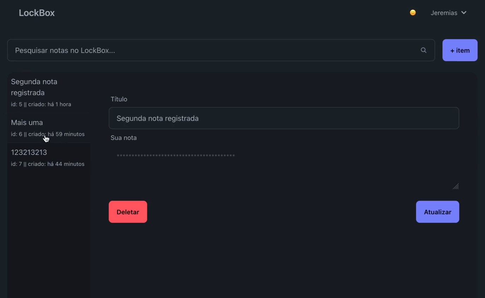

# LockBox

<p align="center">
  
</p>

<p align="center">
Aplicação desenvolvida na Formação de PHP da Rocketseat.
</p>

<p align="center">
  
</p>

<br>

<p align="center">
  
</p>

## Sobre o Projeto

O LockBox é uma aplicação web segura para criar e gerenciar anotações pessoais. O projeto foi desenvolvido em PHP puro, utilizando uma arquitetura semelhante ao padrão MVC (Model-View-Controller) para organizar o código de forma clara e eficiente. As anotações são criptografadas para garantir a privacidade e a segurança dos dados do usuário.

## Funcionalidades

- **Autenticação de Usuários:** Sistema completo de registro e login.
- **Criação de Anotações:** Crie novas anotações com título e conteúdo.
- **Visualização Segura:** As anotações são exibidas apenas após a confirmação da senha do usuário.
- **Gerenciamento de Anotações:** Edite e exclua suas anotações.
- **Pesquisa:** Encontre anotações facilmente com a funcionalidade de pesquisa.
- **Segurança:** As anotações são criptografadas no banco de dados para proteger suas informações.

## Tecnologias Utilizadas

- **Backend:** PHP 8
- **Banco de Dados:** SQLite
- **Gerenciador de Dependências:** Composer
- **Bibliotecas:**
  - `nesbot/carbon`: Para manipulação de datas e horários.
- **Ferramentas de Desenvolvimento:**
  - `laravel/pint`: Para formatação e padronização do código.

## Estrutura de Pastas

A estrutura de pastas do projeto é organizada da seguinte forma:

```
/
├── app/
│   ├── Controllers/  # Controladores da aplicação
│   ├── Middlewares/  # Middlewares de autenticação
│   └── Models/       # Modelos de dados (Usuário, Nota)
├── config/
│   ├── config.php    # Configurações do banco de dados e segurança
│   └── routes.php    # Definição das rotas
├── Core/             # Núcleo do framework (Database, Roteamento, etc.)
├── database/         # Arquivo do banco de dados SQLite
├── public/           # Ponto de entrada da aplicação (index.php)
├── views/            # Arquivos de visualização (HTML e PHP)
├── vendor/           # Dependências do Composer
├── .env              # Arquivo de variáveis de ambiente
├── composer.json     # Definição das dependências do projeto
└── README.md         # Este arquivo
```
